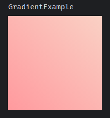
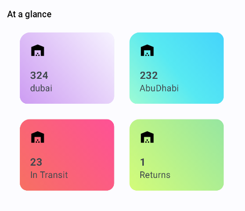

# compose-colors

Material colors and gradients to use with Jetpack compose

table of content

- [compose-colors](#compose-colors)
  - [credit](#credit)
  - [how to use](#how-to-use)
  - [Usage example](#usage-example)
    - [Color](#color)
      - [use Color as background](#use-color-as-background)
      - [use Colors in theme](#use-colors-in-theme)
    - [Gradient](#gradient)
      - [Gradient as background](#gradient-as-background)
        - [example 1](#example-1)
        - [example 2](#example-2)

## credit

- Material Colors: [MaterialUI.co](https://materialui.co/colors/)

- Gradients: [WebGradients.com](https://webgradients.com/)

## how to use

copy [Color.kt](/Color.kt) and [Gradient.kt](/Gradient.kt) into your project

## Usage example

### Color

#### use Color as background

```kotlin
@Preview
@Composable
fun ColorExample() {
    Box(
        modifier = Modifier.size(200.dp)
            .background(DeepPurple500)
    )
}
```

#### use Colors in theme

```kotlin
private val DarkColorScheme = darkColorScheme(
    background = Green900,
    primary = Lime600,
    secondary = Purple400,
)

@Composable
fun ExampleTheme(
    darkTheme: Boolean = isSystemInDarkTheme(),
    dynamicColor: Boolean = true,
    content: @Composable () -> Unit
) {
    val colorScheme = when {
        dynamicColor && Build.VERSION.SDK_INT >= Build.VERSION_CODES.S -> {
            val context = LocalContext.current
            if (darkTheme) dynamicDarkColorScheme(context) else dynamicLightColorScheme(context)
        }
        else -> DarkColorScheme
    }
    val view = LocalView.current
    if (!view.isInEditMode) {
        SideEffect {
            val window = (view.context as Activity).window
            window.statusBarColor = colorScheme.primary.toArgb()
            WindowCompat.getInsetsController(window, view).isAppearanceLightStatusBars = darkTheme
        }
    }

    MaterialTheme(
        colorScheme = colorScheme,
        typography = AppTypography,
        content = content
    )
}
```

### Gradient

#### Gradient as background

##### example 1

visit [WebGradients.com](https://webgradients.com/) to see available gradients, then match gradient name with kotlin variable name

```kotlin
@Preview
@Composable
fun GradientExample() {
    Box(
        modifier = Modifier.size(200.dp)
            .background(
                brush =  Brush.linearGradient(
                    *WarmFlame,
                    start = Offset(0f, Float.POSITIVE_INFINITY),
                    end = Offset(
                        Float.POSITIVE_INFINITY, 0f
                    ),
                )
            )
    )
}
```

result:



##### example 2

code: **see [Example.kt](/Example.kt)**

result:


